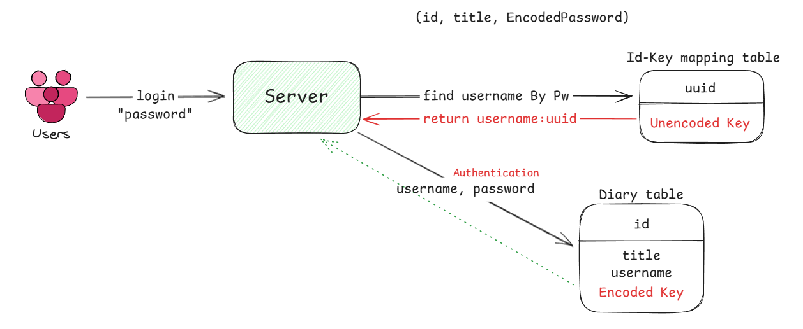

## About Projects
### 나만의 비밀 일기장!

✅ 개인 정보를 저장하지 않아요  
✅ 오로지 비밀번호만으로 접근해요  
✅ 당신이 누구인지, 우리는 몰라요!

 

## Used Skills and Tolls

   
   
  

 

## Tasks
> ❗기존의 프로젝트를 **리팩토링** 중 입니다! 

1. 
    로그인/로그아웃 구현: SpringSecurity, JJWT, Redis
2. 
    다이어리 CRUD: MySQL, JPA
3. 
    게시글 CRUD: MySQL, JPA
4. 
   이미지 처리: S3
5. 
   메일 전송: Gmail SMTP
6. 
   배포: EC2, Docker
7. 
   CI/CD: GitActions

 

## About Refactoring
아래의 문제를 해결하기 위해 리팩토링 중 입니다!
> 🚨 로그인 방식

**기존의 로그인 방식**
1. 패스워드를 기반으로 Id-Key 매핑 테이블에서 username을 찾는다.
2. 다이어리 테이블에서 username을 바탕으로 조회
3. 해당 유저가 가진 암호화된 비밀번호와 일치하는지 인증
4. 토큰 발행

❗**문제점**
- 매핑 테이블에 **암호화되지 않은 비밀번호**가 저장됨
- 로그인을 할 때마다 2번의 조회가 일어남

💡 **해결책**

- 유저에게 id+pw 형태의 문자열을 제공, 로그인 시 입력하게 함
- 서버는 구분자를 기준으로 id와 pw를 나눔
- id를 기반으로 diary를 찾고, 입력한 pw가 암호화된 pw와 일치하는지 검증

✅ 테이블에 **암호화된 비밀번호** 저장되며 1번의 조회만으로 데이터를 찾을 수 있다.

> 이외에도 객체지향, clean code에 대한 의심을 가지고 전체적으로 코드를 리팩토링 하고 있습니다 😊
